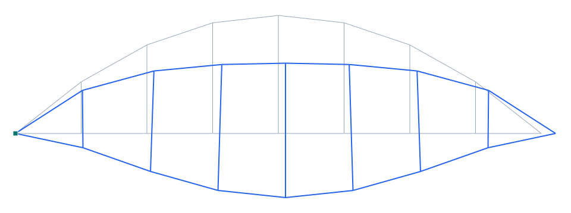

# Arco atirantado (bowstring / tied arch)

**Tipo:** ejemplo de modelado (tipología de puente) · **Modelo Pórtico:** [`examples/puente_arco_atirantado.s3d`](../../examples/puente_arco_atirantado.s3d)

## Descripción

Arco **atirantado** (bowstring) de 80 m de luz y 18 m de flecha. El **arco** (rib) comprime y empuja hacia afuera; el **tablero** actúa de **tirante** (tie), absorbiendo el empuje horizontal a tracción → los apoyos sólo reciben reacción **vertical** (articulado + rodillo). Las **péndolas** cuelgan el tablero del arco. Es el esquema autoequilibrado típico del bowstring.

| Propiedad | Valor |
| --- | --- |
| Luz | 80 m |
| Flecha del arco | 18 m |
| Tirante | el propio tablero (a tracción) |
| Péndolas | 7 verticales |
| Apoyos | articulado + rodillo (sólo vertical) |
| Cargas | peso propio + sobrecarga 20 kN/m |

## Modelo en Pórtico

- El **tablero–tirante** toma el empuje del arco como **axial de tracción** → no se necesita un apoyo que resista el empuje horizontal (de ahí el rodillo).
- El **arco** trabaja a compresión + flexión; las **péndolas**, a tracción.
- Para ver la tracción del tirante: diagrama de **axial N** del tablero.

*Figura. Elevación del puente y su deformada bajo peso propio + sobrecarga (×escala). En gris la geometría sin deformar; en azul la deformada.*

## Resultados (peso propio + sobrecarga 20 kN/m)

| Magnitud | Valor |
| --- | --- |
| Nodos · elementos | 16 · 23 |
| ΣReacciones verticales | 1919 kN (equilibrio con la carga total) |
| Desplazamiento máx. |u| | 12.2 mm |
| Axial máx. |N| | 1198 kN |
| Momento máx. |M| | 1461 kN·m |

## Conclusión

El arco comprime, el tablero–tirante tracciona y equilibra el empuje, y las péndolas cuelgan el tablero — con apoyos sólo verticales. Ejemplo de **arco atirantado** en Pórtico.
