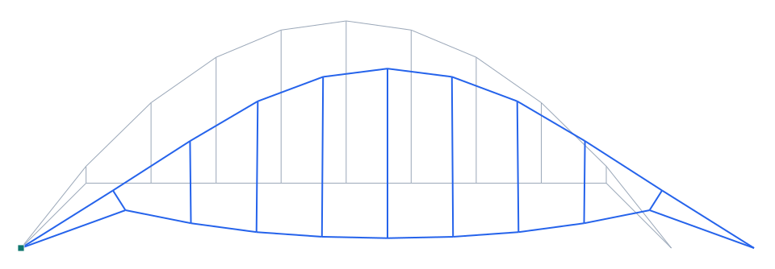

# Arco de tablero inferior (through arch, tipo Barqueta)

**Tipo:** ejemplo de modelado (tipología de puente) · **Modelo Pórtico:** [`examples/puente_arco_inferior.s3d`](../../examples/puente_arco_inferior.s3d)

## Descripción

Arco de **tablero inferior** (through arch), inspirado en el **Puente de la Barqueta** (Sevilla): el **arco** arranca por debajo del nivel del tablero, lo cruza y se eleva sobre él; el **tablero** cuelga del arco mediante **péndolas** y se ata a los pies del arco con **tirantes** que recogen el empuje. Los apoyos están en los **pies del arco** (articulado + rodillo).

| Propiedad | Valor |
| --- | --- |
| Luz | 80 m |
| Flecha del arco | 20 m (pies a −8 m) |
| Tablero | inferior, colgado del arco |
| Tirantes | pies del arco ↔ extremos del tablero |
| Apoyos | pies del arco (articulado + rodillo) |
| Cargas | peso propio + sobrecarga 20 kN/m |

## Modelo en Pórtico

- El **arco** cruza el nivel del tablero: en el tramo central va por encima (péndolas a tracción) y en los extremos baja a los apoyos.
- Los **tirantes** de extremo recogen el **empuje** del arco y lo cierran contra el tablero (esquema autoequilibrado, como el bowstring).
- Variante de la familia de arcos; el **arco atirantado tipo network** (péndolas inclinadas cruzadas) se verificará contra una memoria de tesis.

*Figura. Elevación del puente y su deformada bajo peso propio + sobrecarga (×escala). En gris la geometría sin deformar; en azul la deformada.*

## Resultados (peso propio + sobrecarga 20 kN/m)

| Magnitud | Valor |
| --- | --- |
| Nodos · elementos | 20 · 29 |
| ΣReacciones verticales | 1583 kN (equilibrio con la carga total) |
| Desplazamiento máx. |u| | 36.0 mm |
| Axial máx. |N| | 1414 kN |
| Momento máx. |M| | 3585 kN·m |

## Conclusión

El arco de tablero inferior cuelga el tablero por péndolas y cierra el empuje con los tirantes de pie; resuelve en equilibrio. Ejemplo «tipo Barqueta» en Pórtico.
