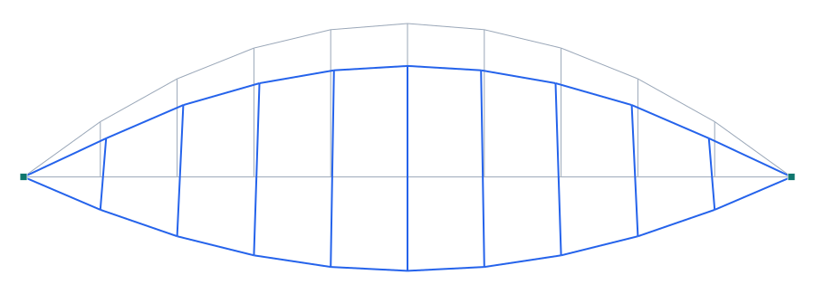
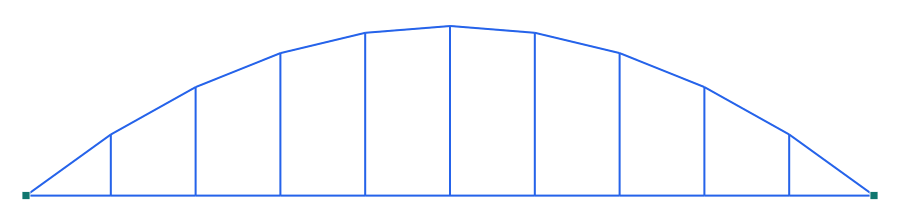
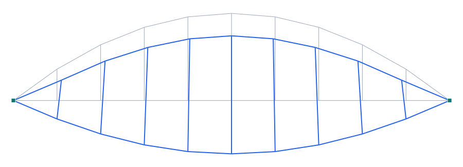

# Puente en arco — caso completo: lineal + pandeo lateral + etapas constructivas

**Tipo:** caso de estudio (3 análisis sobre un mismo arco) · **Modelo:** [`examples/puente_arco_showcase.s3d`](../../examples/puente_arco_showcase.s3d)

## Estructura

Arco atirantado (bowstring) **3D** de **100 m de luz** y **20 m de flecha**: un **arco** (cajón de acero) del que cuelga un **tablero-tirante** por **péndolas** verticales. El arco es rígido en su plano (I_y grande) y **más flexible fuera del plano** (I_z menor), de modo que el modo crítico es el **pandeo lateral**. El tablero está **arriostrado lateralmente** (u_y fijo), así que el arco pandea fuera del plano sin que las péndolas (verticales) lo impidan.

## 1) Análisis estático lineal

Bajo peso propio + sobrecarga de 60 kN/m sobre el tablero:

| Magnitud | Valor |
| --- | --- |
| Desplazamiento máx. |u| | 19.2 mm |
| Axial máx. de compresión en el arco | -5009 kN |

*Figura 1. Deformada estática lineal (×escala): el arco comprime, el tablero-tirante tracciona y las péndolas cuelgan el tablero.*

## 2) Pandeo LATERAL del arco (autovalores λcr)

Sobre el estado de referencia anterior se ensambla la **rigidez geométrica** `Kg` y se resuelve el problema de autovalores **(K + λ·Kg)·φ = 0** (iteración de subespacio). El primer modo:

| Magnitud | Valor |
| --- | --- |
| Factor crítico de pandeo λcr | 35.44 |
| Naturaleza del 1er modo | **LATERAL** (fuera del plano, u_y domina) ✔ |
| Carga axial crítica del arco P_cr ≈ λcr·N | 177506 kN |
| Modos calculados (λ) | 35.44, 37.28, 49.25, 78.18 |

*Figura 2. Primer modo de pandeo: el arco se desplaza **fuera de su plano** (pandeo lateral). λcr indica cuántas veces la carga de referencia lleva al arco al pandeo. Un arco real necesita **arriostramiento lateral** entre arcos/vientos para subir λcr.*

## 3) Etapas constructivas

Secuencia de montaje (el estado se **acumula** por fase; los elementos nacen libres de tensión al activarse):

1. **Arco** — se erige y toma su **peso propio**.
2. **Tablero + péndolas** — se cuelgan (nacen en la geometría deformada del arco, sin tensión previa) y aportan su peso.
3. **Sobrecarga** de tránsito.

| Magnitud | Por etapas | Monolítico (lineal) |
| --- | --- | --- |
| Desplazamiento máx. |u| | 18.9 mm | 19.2 mm |
| Axial máx. de compresión en el arco | -5011 kN | -5009 kN |

*Figura 3. Estado acumulado al final de la construcción por etapas. Difiere del montaje monolítico porque el tablero/péndolas no participan del peso propio del arco (nacen después).*

## Conclusión

Un mismo puente en arco se analiza en **tres niveles**: (1) **estático lineal** (esfuerzos y deformaciones de servicio), (2) **pandeo lateral** (λcr = 35.44, modo fuera del plano → dimensiona el arriostramiento del arco), y (3) **etapas constructivas** (el orden de montaje cambia el estado final). Combina los motores de **estático**, **pandeo (Kg)** y **staged** de Pórtico en un caso realista.
