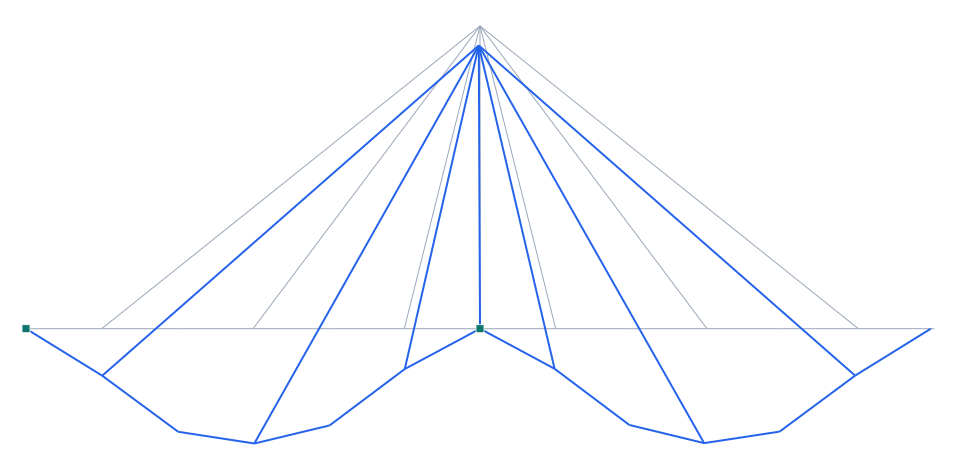

# Puente atirantado (cable-stayed)

**Tipo:** ejemplo de modelado (tipología de puente) · **Modelo Pórtico:** [`examples/puente_atirantado.s3d`](../../examples/puente_atirantado.s3d)

## Descripción

Puente **atirantado** de 120 m con **pilón central** de 40 m y tirantes en **abanico**. El tablero (cajón de hormigón) se sostiene por los tirantes anclados en la cabeza del pilón; los tirantes trabajan a **tracción** y «cuelgan» el tablero, reduciendo su flexión. La base del pilón es un apoyo fijo (pila), y los estribos son articulado y rodillo.

| Propiedad | Valor |
| --- | --- |
| Luz total | 120 m (12 tramos de 10 m) |
| Pilón | central, 40 m |
| Tirantes | abanico, 6+ a cada lado |
| Tablero | cajón H35, A=0.9 m², I=0.6 m⁴ |
| Cargas | peso propio + sobrecarga 20 kN/m |

## Modelo en Pórtico

- Los **tirantes** se modelan como elementos de sección esbelta (predomina el axial); para slackening/dinámico se activa el flag *tension-only* (cable) y el solver NL-lite.
- El **pilón** se empotra en su base (pila); los estribos son articulado (X fijo) y rodillo (X libre) para dejar la dilatación del tablero.
- Cada tirante transmite una componente **vertical** (cuelga el tablero) y **horizontal** (comprime el tablero hacia el pilón).

*Figura. Elevación del puente y su deformada bajo peso propio + sobrecarga (×escala). En gris la geometría sin deformar; en azul la deformada.*

## Resultados (peso propio + sobrecarga 20 kN/m)

| Magnitud | Valor |
| --- | --- |
| Nodos · elementos | 14 · 19 |
| ΣReacciones verticales | 2759 kN (equilibrio con la carga total) |
| Desplazamiento máx. |u| | 15.2 mm |
| Axial máx. |N| | 1231 kN |
| Momento máx. |M| | 3321 kN·m |

## Conclusión

El modelo resuelve en equilibrio: los tirantes traccionan y el tablero queda colgado del pilón, con la flexión repartida. Ejemplo de modelado de **puente atirantado** en Pórtico (tirantes + pilón + tablero).
