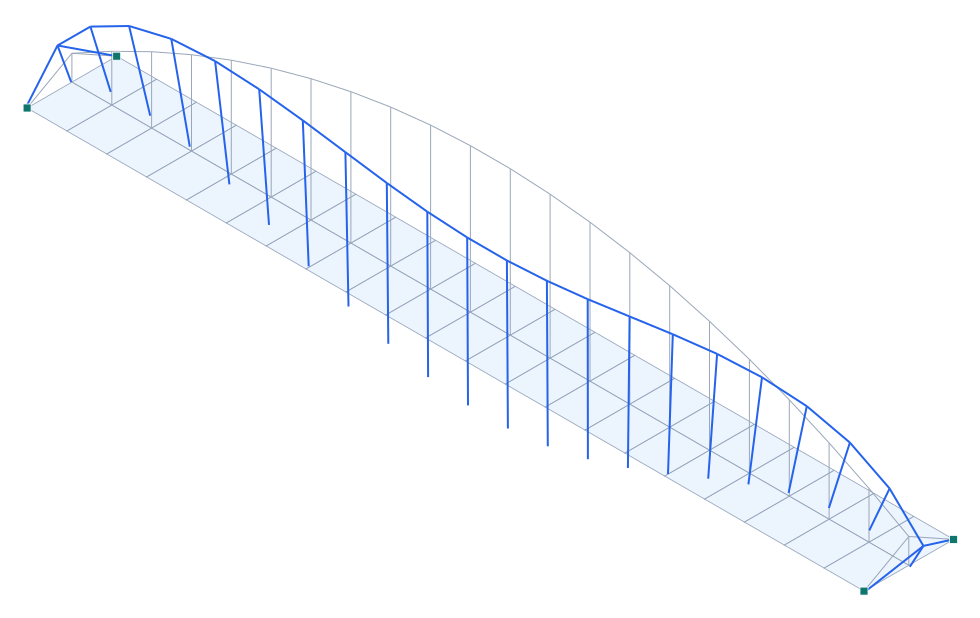

# Puente de la Barqueta (Sevilla, 1992) — arco con péndolas verticales, tablero de áreas y análisis no lineal

**Tipo:** ejemplo 3D con **geometría real**, **tablero de elementos de área (shell)** y **análisis geométrico no lineal** · **Modelo:** [`examples/puente_barqueta.s3d`](../../examples/puente_barqueta.s3d)

## Descripción

El **Puente de la Barqueta** (Sevilla, Juan José Arenas y Marcos J. Pantaleón, Expo'92) salva el Guadalquivir con **un solo vano de 168 m**. Es un **arco atirantado** con **un único arco central** del que cuelga el tablero mediante un **conjunto de péndolas casi verticales, en un único plano central, que no se cruzan**. En cada extremo, **pórticos triangulares** (las «puertas») recogen el arranque del arco. El tablero (mixto acero-hormigón) actúa además de **tirante**, cerrando el empuje del arco.

| Propiedad | Valor |
| --- | --- |
| Luz | 168 m (vano único) |
| Ancho del tablero (modelo) | 18 m |
| Arco | único, central, flecha ~24 m |
| Péndolas | casi verticales, plano central, sin cruzarse (tension-only) |
| Extremos | pórticos triangulares («puertas») |
| Tablero | elementos de ÁREA (shell), tirante |
| Autores / año | Arenas & Pantaleón / 1992 |

## Modelo en Pórtico

- El **tablero** se modela con **42 elementos de área (QUAD shell)** — membrana (acción de tirante en su plano) + placa (flexión transversal). El tablero como áreas, no como viga.
- El **arco** central (plano longitudinal medio) es una cadena de elementos viga; los **pórticos triangulares** de extremo conectan el arranque del arco con las esquinas del tablero.
- Las **péndolas** son **casi verticales** (cada nodo del arco baja a la dovela del tablero directamente bajo él, en el plano central) y **no se cruzan**; se marcan **tension-only** (cable) para el análisis no lineal.
- Apoyos en las **4 esquinas** del tablero (uno fijo en planta, los demás liberan la dilatación); el tablero-tirante absorbe el **empuje** del arco.

*Figura. Vista 3D: tablero (áreas), arco central, pórticos triangulares y péndolas verticales, con la deformada no lineal (×escala) bajo peso propio + carga de tablero.*

## Resultados — análisis lineal vs. GEOMÉTRICO NO LINEAL (P-Δ)

Se resuelve primero el estático **lineal** y luego el **geométrico no lineal** iterando la **rigidez geométrica** `Kg` (rigidización por tracción de las péndolas y el arco) hasta converger — el comportamiento real de una estructura cable-arco.

| Magnitud | Valor |
| --- | --- |
| Nodos · elementos · áreas | 88 · 47 · 42 |
| ΣReacciones verticales | 36498 kN |
| Desplazamiento máx. |u| — lineal | 858.5 mm |
| Desplazamiento máx. |u| — no lineal (P-Δ) | 973.7 mm |
| Efecto geométrico (Δ no lineal / lineal) | 1.134 |
| Axial máx. |N| (arco/tirante) | 30212 kN |

## Conclusión

El modelo reproduce la **forma real** de la Barqueta —arco único central, **péndolas casi verticales en plano único que no se cruzan** y pórticos triangulares de extremo— con el **tablero modelado por elementos de área (shell)** que trabaja de tirante. Además del estático lineal se ejecuta un **análisis geométrico no lineal (P-Δ con Kg)** que captura la rigidización por tracción de las péndolas/arco (las péndolas se marcan **tension-only**). Ejemplo avanzado que combina **barras + áreas + no linealidad geométrica** en un puente real.
