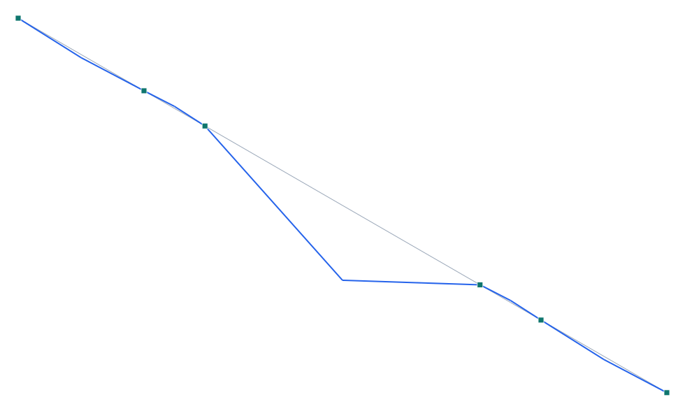

# Puente Cau Cau / Treng Treng – Kay Kay (Valdivia) — basculante

**Tipo:** ejemplo de modelado con **geometría real** · **Modelo:** [`examples/puente_cau_cau.s3d`](../../examples/puente_cau_cau.s3d)

## Descripción

El **Puente Cau Cau** (Valdivia, también llamado **Treng Treng / Kay Kay**) es un **puente basculante** de doble hoja sobre el río Cau Cau. La estructura principal son **5 vanos** (32 / 15.5 / 70 / 15.5 / 32 m): el vano central de 70 m es el canal navegable que cruzan las **dos hojas basculantes** (con contrapesos en los vanos de 15.5 m), articuladas para abrirse. El tablero central es una **losa ortótropa de acero** sobre dos vigas longitudinales de canto variable. Se modela en **posición cerrada**, con una **rótula** en el encuentro de las hojas.

| Propiedad | Valor |
| --- | --- |
| Vanos | 32 / 15.5 / 70 / 15.5 / 32 m |
| Vano navegable | 70 m (dos hojas basculantes) |
| Contrapesos | vanos de 15.5 m |
| Tablero | losa ortótropa de acero, vigas de canto variable |
| Longitud | 165 m (principal) |
| Ubicación | Valdivia, Chile |

## Modelo en Pórtico

- Se modela el puente **cerrado**: cada **hoja** es un voladizo equilibrado que pivota sobre su pila; en el centro las hojas se encuentran con una **rótula** (transmite cortante, no momento).
- Las **pilas** son apoyos verticales (una fija en X para la estabilidad longitudinal).
- El mecanismo de **apertura** (giro de las hojas con sistemas hidráulicos) no se modela aquí — sólo el estado de servicio cerrado.

*Figura. Elevación y deformada bajo peso propio + sobrecarga (×escala). Gris: sin deformar; azul: deformada.*

## Resultados (peso propio + sobrecarga)

| Magnitud | Valor |
| --- | --- |
| Nodos · elementos · áreas | 11 · 10 · 0 |
| ΣReacciones verticales | 6245 kN |
| Desplazamiento máx. |u| | 30.3 mm |
| Axial máx. |N| | 0 kN |
| Momento máx. |M| | 23183 kN·m |

## Conclusión

El modelo del Cau Cau reproduce el esquema basculante cerrado: hojas que se encuentran en el centro con una rótula y se apoyan en las pilas. Ejemplo de **puente basculante** (un ícono de Valdivia) en Pórtico.
