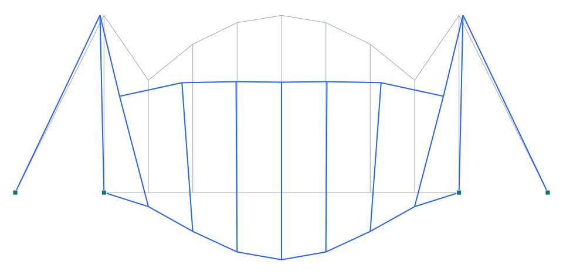

# Puente colgante (suspension)

**Tipo:** ejemplo de modelado (tipología de puente) · **Modelo Pórtico:** [`examples/puente_colgante.s3d`](../../examples/puente_colgante.s3d)

## Descripción

Puente **colgante** con vano principal de 80 m entre dos **torres** de 40 m. El **cable principal** describe una parábola (funicular de la carga uniforme) anclado en los extremos; de él cuelgan las **péndolas** verticales que sostienen el tablero. El cable trabaja a tracción pura y transmite el empuje a las torres y a los anclajes.

| Propiedad | Valor |
| --- | --- |
| Vano principal | 80 m (torres en x=20 y 100) |
| Torres | 40 m |
| Flecha del cable | 26 m |
| Péndolas | verticales cada 10 m |
| Cargas | peso propio + sobrecarga 20 kN/m |

## Modelo en Pórtico

- El **cable principal** se traza sobre su parábola funicular → bajo carga uniforme trabaja a **axial puro** (sin flexión).
- Las **péndolas** transfieren la carga del tablero al cable; el cable la lleva a torres y **anclajes** (apoyos fijos).
- Las **torres** se empotran en su base; el tablero se apoya en su nivel inferior.

*Figura. Elevación del puente y su deformada bajo peso propio + sobrecarga (×escala). En gris la geometría sin deformar; en azul la deformada.*

## Resultados (peso propio + sobrecarga 20 kN/m)

| Magnitud | Valor |
| --- | --- |
| Nodos · elementos | 20 · 27 |
| ΣReacciones verticales | 1929 kN (equilibrio con la carga total) |
| Desplazamiento máx. |u| | 126.1 mm |
| Axial máx. |N| | 186 kN |
| Momento máx. |M| | 12345 kN·m |

## Conclusión

El cable y las péndolas trabajan a tracción y cuelgan el tablero; las torres reciben la carga vertical y el empuje del cable. Ejemplo de modelado de **puente colgante** en Pórtico.
