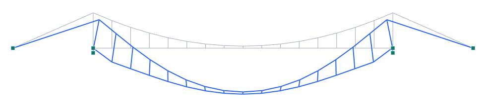

# Puente Golden Gate (1937) — colgante

**Tipo:** ejemplo de modelado con **geometría real** · **Modelo:** [`examples/puente_golden_gate.s3d`](../../examples/puente_golden_gate.s3d)

## Descripción

El **Golden Gate** (San Francisco, 1937) es un **puente colgante** de **1280 m de vano principal** y vanos laterales de **343 m**, con **torres de ~152 m sobre el tablero** y **cable principal** de flecha ~143 m. Dos cables principales sostienen el tablero (ancho ~27 m) por péndolas verticales y transmiten el empuje a torres y **anclajes** masivos.

| Propiedad | Valor |
| --- | --- |
| Vano principal | 1280 m |
| Vanos laterales | 343 m c/u |
| Altura de torres | ~227 m sobre el agua (~152 m sobre el tablero) |
| Flecha del cable | ~143 m |
| Ancho | 27 m |
| Año | 1937 |

## Modelo en Pórtico

- El **cable principal** sigue su parábola funicular (tracción pura bajo carga uniforme) y se ancla en los extremos.
- Las **péndolas** verticales cuelgan el tablero del cable; las **torres** llevan la carga a las fundaciones.
- En 2D se modela un plano; el puente real tiene dos cables/planos.
- ⚠️ **Modelo lineal:** un cable real toma su rigidez transversal de la **tracción** (rigidización geométrica). Aquí el cable se modela con rigidez a flexión para un análisis lineal estable; para resultados precisos use el **análisis geométrico/no lineal** (Kg / NL-lite) de Pórtico — las flechas del modelo lineal son mayores que las reales.

*Figura. Elevación y deformada bajo peso propio + sobrecarga (×escala). Gris: sin deformar; azul: deformada.*

## Resultados (peso propio + sobrecarga)

| Magnitud | Valor |
| --- | --- |
| Nodos · elementos · áreas | 40 · 55 · 0 |
| ΣReacciones verticales | 52879 kN |
| Desplazamiento máx. |u| | 6378.3 mm |
| Axial máx. |N| | 34346 kN |
| Momento máx. |M| | 4457004 kN·m |

## Conclusión

Ejemplo del puente colgante de mayor luz de su época: cable funicular a tracción, péndolas que cuelgan el tablero, torres y anclajes.
