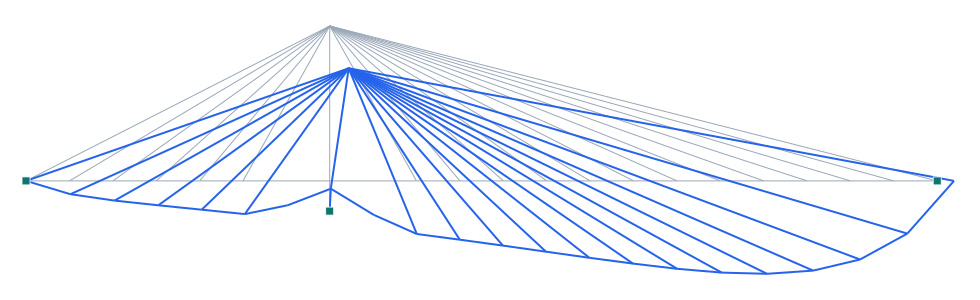

# Puente Severin / Severinsbrücke (Colonia, 1959) — atirantado en abanico

**Tipo:** ejemplo de modelado con **geometría real** · **Modelo:** [`examples/puente_severin.s3d`](../../examples/puente_severin.s3d)

## Descripción

La **Severinsbrücke** (Colonia, 1959) fue el primer puente **atirantado con pilón en forma de A** y, en su época, el de mayor vano principal (**302 m**). El **pilón** se eleva ~77 m sobre el tablero en una orilla; los **tirantes** parten de su cabeza en **abanico (fan)** sosteniendo el tablero del vano principal, con un vano posterior anclado que equilibra.

| Propiedad | Valor |
| --- | --- |
| Vano principal | 302 m |
| Vano posterior | ~151 m (equilibrio) |
| Pilón (A) | ~77 m sobre el tablero |
| Sistema | atirantado en abanico (fan), asimétrico |
| Longitud total | 691 m |
| Año | 1959 |

## Modelo en Pórtico

- Asimétrico: el **vano posterior anclado** equilibra el tirón del vano principal sobre el pilón.
- El **pilón en A** se representa en 2D como un mástil; los tirantes nacen de su cabeza.
- Los **tirantes** trabajan a tracción y «cuelgan» el tablero reduciendo su flexión.
- ⚠️ **Modelo lineal:** los tirantes se modelan con rigidez a flexión para estabilidad lineal; para precisión use el análisis **geométrico/no lineal** (Kg / NL-lite) de Pórtico.

*Figura. Elevación y deformada bajo peso propio + sobrecarga (×escala). Gris: sin deformar; azul: deformada.*

## Resultados (peso propio + sobrecarga)

| Magnitud | Valor |
| --- | --- |
| Nodos · elementos · áreas | 24 · 42 · 0 |
| ΣReacciones verticales | 30253 kN |
| Desplazamiento máx. |u| | 158.8 mm |
| Axial máx. |N| | 18579 kN |
| Momento máx. |M| | 345740 kN·m |

## Conclusión

El modelo reproduce el esquema atirantado asimétrico de la Severinsbrücke: pilón alto en una orilla, abanico de tirantes sobre el vano principal y vano posterior de equilibrio. Ejemplo de **atirantado en abanico** en Pórtico.
