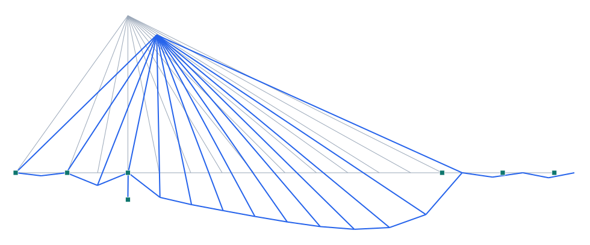

# Puente Treng Treng – Kay Kay (Temuco) — atirantado asimétrico de mástil único

**Tipo:** ejemplo de modelado con **geometría real** · **Modelo:** [`examples/puente_treng_treng.s3d`](../../examples/puente_treng_treng.s3d)

## Descripción

El **Puente Treng Treng – Kay Kay** (Temuco, sobre el **río Cautín**) es un **puente atirantado asimétrico** con un **único mástil de 70 m** que sostiene el vano atirantado central de **140 m**. Tiene **240 m** en 5 vanos (23 / 27 / **140** / 27 / 23 m) y tablero de hormigón pretensado de 27 m de ancho. La forma quebrada del mástil evoca la leyenda mapuche de las serpientes **Treng Treng** y **Kay Kay**. Los tirantes parten de la cabeza del mástil en **abanico** sobre el vano principal, con **retenidas** (back-stays) hacia los vanos de aproximación que equilibran.

| Propiedad | Valor |
| --- | --- |
| Longitud total | 240 m (5 vanos) |
| Vanos | 23 / 27 / 140 / 27 / 23 m |
| Vano atirantado | 140 m |
| Mástil | 70 m (único, asimétrico) |
| Tablero | hormigón pretensado, 27 m de ancho |
| Ubicación | Temuco, río Cautín, Chile (2023) |

## Modelo en Pórtico

- Atirantado **asimétrico**: los tirantes del vano principal se equilibran con **retenidas** ancladas en los vanos de aproximación (sobre las pilas).
- El **mástil único** (en 2D un mástil; en realidad dos columnas quebradas unidas en la cabeza) ancla todos los tirantes en su coronación.
- Las pilas de aproximación son **apoyos verticales**; el mástil se empotra en su base.
- Los **tirantes** trabajan a tracción y cuelgan el tablero del vano de 140 m.

*Figura. Elevación y deformada bajo peso propio + sobrecarga (×escala). Gris: sin deformar; azul: deformada.*

## Resultados (peso propio + sobrecarga)

| Magnitud | Valor |
| --- | --- |
| Nodos · elementos · áreas | 21 · 33 · 0 |
| ΣReacciones verticales | 14123 kN |
| Desplazamiento máx. |u| | 15.2 mm |
| Axial máx. |N| | 3225 kN |
| Momento máx. |M| | 110186 kN·m |

## Conclusión

El modelo reproduce el esquema atirantado asimétrico del Treng Treng – Kay Kay de Temuco: mástil único, abanico de tirantes sobre el vano de 140 m y retenidas de equilibrio. Ejemplo de **atirantado asimétrico** (ícono de La Araucanía) en Pórtico.
