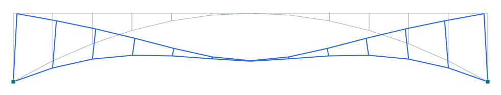

# Puente Salginatobel (Maillart, 1930) — arco de hormigón de tres rótulas

**Tipo:** ejemplo de modelado con **geometría real** · **Modelo:** [`examples/salginatobel.s3d`](../../examples/salginatobel.s3d)

## Descripción

El **Salginatobel** (Robert Maillart, 1930, Suiza) es un **arco de hormigón armado de tres rótulas** (rótulas en los dos arranques y en la clave) de **90 m de luz** y **13 m de flecha**, con tablero de 3.5 m de ancho. Sobre la zona central el arco y el tablero se funden en una **viga cajón hueca**; hacia los extremos, montantes (spandrels) conectan el tablero con el arco. Es una obra maestra del hormigón y Monumento Histórico de la Ingeniería (ASCE).

| Propiedad | Valor |
| --- | --- |
| Luz del arco | 90 m |
| Flecha | 13 m |
| Longitud total | 133 m |
| Ancho del tablero | 3.5 m |
| Tipo | arco H.A. de tres rótulas (cajón hueco central) |
| Año / autor | 1930 / Robert Maillart |

## Modelo en Pórtico

- Las **tres rótulas** (dos arranques + clave) se modelan: arranques como **apoyos articulados** (giro libre) y la clave **liberando el momento** en el extremo de un elemento del arco.
- Los **montantes** transfieren la carga del tablero al arco; en el centro arco y tablero se unen (cajón).
- El arco trabaja esencialmente a **compresión**; el tablero reparte la sobrecarga.

*Figura. Elevación y deformada bajo peso propio + sobrecarga (×escala). Gris: sin deformar; azul: deformada.*

## Resultados (peso propio + sobrecarga)

| Magnitud | Valor |
| --- | --- |
| Nodos · elementos · áreas | 26 · 36 · 0 |
| ΣReacciones verticales | 3206 kN |
| Desplazamiento máx. |u| | 15.4 mm |
| Axial máx. |N| | 2808 kN |
| Momento máx. |M| | 2370 kN·m |

## Conclusión

El arco de tres rótulas reproduce la forma y el comportamiento del Salginatobel: compresión dominante en el arco, montantes que cuelgan/apoyan el tablero, y rótulas que lo hacen isostático en su esquema básico. Ejemplo de **arco de hormigón** en Pórtico.
