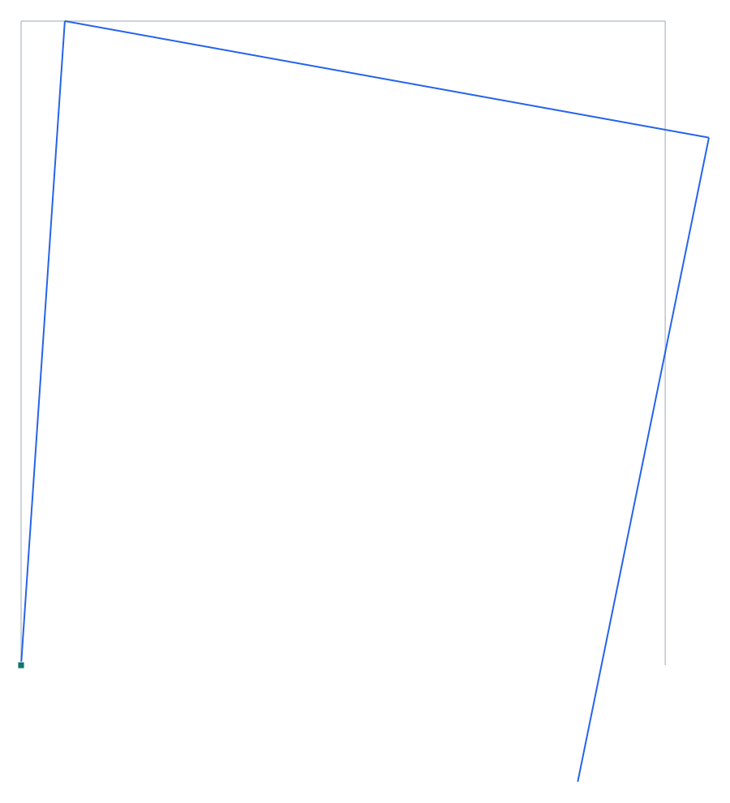

# Verificación 1-005 — Asentamiento de apoyo (desplazamiento prescrito)

**Capacidad verificada:** desplazamiento prescrito de nodo/apoyo (asentamiento), partición libre/prescrito en el solver.
**Referencia:** CSI *Software Verification — SAP2000*, Example 1-005 (Model A); resultados independientes por el método de la carga unitaria (Cook & Young 1985, p. 244).
**Modelo Pórtico:** [`examples/verif_1-005a_asentamiento.s3d`](../../examples/verif_1-005a_asentamiento.s3d)

## Descripción del problema

Pórtico de un vano (columnas de 144 in y viga de 144 in) con **base izquierda empotrada** (nodo 1) y **apoyo deslizante** (rodillo) en la base derecha (nodo 4). Al apoyo deslizante se le impone un **asentamiento vertical Uz = −0.5"** (desplazamiento prescrito). Se comparan las **reacciones en el empotramiento** (nodo 1): fuerza vertical F_z y momento M_y. **Sólo se consideran deformaciones por flexión** (axial y corte rígidos), como en el original.

| Propiedad | Valor |
| --- | --- |
| Geometría | portal 144 × 144 in |
| Apoyos | nodo 1 empotrado · nodo 4 rodillo (Uz prescrito) |
| Módulo E | 29 000 k/in² |
| Sección | b = d = 12 in, I = 1 728 in⁴ |
| Carga | asentamiento Uz = −0.5" en el nodo 4 |

## Modelo en Pórtico

- Modelo **2D**, juntas viga-columna **rígidas**; base izquierda empotrada, base derecha en rodillo vertical.
- El asentamiento es un **desplazamiento prescrito** del GDL Uz del nodo 4 (`node.prescDisp.uz = −0.5`, #54): el solver lo trata como GDL soporte con valor, `Kff·uf = Ff − Kfp·u_p`, y reporta la reacción del apoyo.
- **Sólo flexión**: área axial y áreas de corte hechas rígidas (A, Av enormes) → se ignoran las deformaciones axial y de corte, igual que el original (mod. área 1e5, sin corte).

*Figura 1. Deformada por el asentamiento de 0.5" del apoyo derecho (×escala). En gris el portal sin deformar; en azul la deformada — el rodillo baja y el empotramiento izquierdo toma la reacción.*

## Resultados — comparación

Reacciones en el empotramiento (nodo 1) bajo el asentamiento prescrito. La referencia independiente coincide exactamente con SAP2000.

| Reacción | Descripción | Independiente (kip · kip-in) | SAP2000 (kip · kip-in) | dif. SAP | **Pórtico (kip · kip-in)** | **dif. Pórtico** |
| --- | --- | --- | --- | --- | --- | --- |
| F_z | Reacción vertical en el nodo 1 | 6.293 | 6.293 | 0 % | **6.293** | **+0.01 %** |
| M_y | Momento de empotramiento en el nodo 1 | -906.250 | -906.250 | 0 % | **-906.250** | **0 %** |

## Conclusión

Pórtico reproduce las reacciones del Model A con **diferencia 0.000 %** (F_z = 6.293 kip, M_y = −906.250 kip-in), idénticas a la solución independiente y a SAP2000. El **desplazamiento prescrito** (asentamiento de apoyo, #54) y la **reacción del GDL prescrito** quedan validados contra el manual CSI. **Capacidad de asentamiento de apoyo verificada.**
