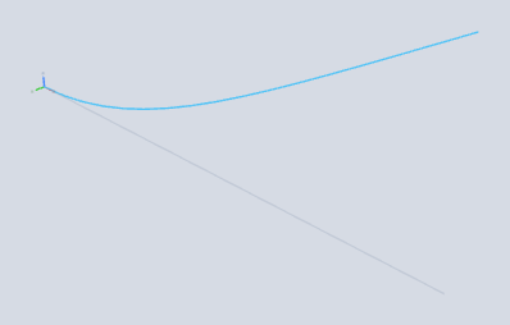

# Verificación 1-014 — Análisis modal de viga en voladizo

**Capacidad verificada:** análisis modal (frecuencias y formas modales de flexión).
**Referencia:** CSI *Software Verification — SAP2000*, Example 1-014; solución
independiente de **Clough & Penzien (1975)** para un voladizo de masa uniforme y `EI` constante.
**Modelo Pórtico:** [`examples/verif_1-014_modal_voladizo.s3d`](../../examples/verif_1-014_modal_voladizo.s3d)

## Descripción del problema

Viga en voladizo de **96 in** (8 ft) de hormigón, sección rectangular 12×18 in, con
`I` distinto en cada eje. Se comparan los **cinco primeros modos de flexión** contra la
solución analítica. Sólo se consideran modos de flexión: se excluyen los GDL axial (Ux)
y torsional (Rx), y se **ignora la deformación por corte** (teoría de Euler-Bernoulli).

| Propiedad | Valor (sistema kip–in–s) |
|---|---|
| Longitud L | 96 in |
| Módulo E | 3 600 k/in² |
| Masa por volumen ρ | 2.3·10⁻⁷ k·s²/in⁴ |
| Área A | 216 in² |
| I sobre eje fuerte (Y) | 5 832 in⁴ |
| I sobre eje débil (Z) | 2 592 in⁴ |

> Pórtico opera en un sistema de unidades consistente (no convierte); se ingresan los
> valores en kip–in–s y los periodos resultan en segundos.

## Modelo en Pórtico

Voladizo discretizado en **16 elementos**, empotrado en la base. Para reproducir las
hipótesis del caso de referencia:

- **`Avy = Avz = 0`** → el elemento se comporta como **Euler-Bernoulli** (sin deformación
  por corte), igual que el original (que anula el área de corte).
- Se **restringen Ux y Rx** en todos los nodos → sólo aparecen modos de flexión.
- Masa **consistente** (Pórtico) — converge más rápido al valor analítico que la masa
  concentrada del software de referencia.

*Figura 1. Modo 1 (T = 0.038 s) — primera flexión del voladizo. En gris la geometría sin
deformar; en azul la forma modal.*

## Resultados — comparación

Periodos de los cinco primeros modos de flexión. Referencia analítica = solución
independiente de Clough & Penzien; software de referencia = **SAP2000** en su malla más
fina (Modelo G, 96 elementos, masa concentrada). La diferencia se calcula contra la
solución independiente.

| Modo | Descripción | Independiente (s) | SAP2000 96 el (s) | dif. SAP | **Pórtico 16 el (s)** | **dif. Pórtico** |
|---|---|---|---|---|---|---|
| 1 | 1ª flexión, eje débil | 0.038005 | 0.038003 | −0.01 % | **0.038001** | **−0.01 %** |
| 2 | 1ª flexión, eje fuerte | 0.025337 | 0.025335 | −0.01 % | **0.025334** | **−0.01 %** |
| 3 | 2ª flexión, eje débil | 0.006064 | 0.006065 | +0.02 % | **0.006064** | **0.00 %** |
| 4 | 2ª flexión, eje fuerte | 0.004043 | 0.004043 | 0 % | **0.004042** | **−0.02 %** |
| 5 | 3ª flexión, eje débil | 0.002165 | 0.002166 | +0.05 % | **0.002166** | **+0.05 %** |

Pórtico coincide tanto con la solución analítica como con el resultado convergido de
SAP2000, en los tres casos con error **≤ 0.05 %**. El cociente
`T₁/T₂ = 0.038001/0.025334 = 1.500 = √(5832/2592)` confirma que el modelo distingue
correctamente la rigidez de flexión en cada eje.

### Convergencia (modo 1) — masa consistente vs. concentrada

SAP2000 usa **masa concentrada**, que converge lentamente con la discretización; Pórtico
usa **masa consistente**, que converge mucho más rápido. Periodo del modo 1 (independiente
= 0.038005 s):

| Discretización | SAP2000 (s) | dif. SAP | Pórtico 16 el (s) | dif. Pórtico |
|---|---|---|---|---|
| 1 elem (A) | 0.054547 | +43.53 % | — | — |
| 2 elem (B) | 0.042333 | +11.39 % | — | — |
| 4 elem (C) | 0.039090 | +2.85 % | — | — |
| 8 elem (E) | 0.038273 | +0.71 % | — | — |
| 10 elem (F) | 0.038175 | +0.45 % | **0.038001** | **−0.01 %** |
| 96 elem (G) | 0.038003 | −0.01 % | — | — |

Con sólo **16 elementos** Pórtico alcanza la precisión que SAP2000 logra con **96**.

## Conclusión

Pórtico reproduce los periodos modales con **error ≤ 0.05 % en los cinco modos**, en
coincidencia con la solución analítica de Clough & Penzien y con el resultado convergido
del software de referencia (SAP2000, 96 elementos). La rápida convergencia con sólo 16
elementos se debe a la combinación de **masa consistente** y elemento **Euler-Bernoulli**
(`Avy = Avz = 0`, sin deformación por corte). **Capacidad modal de Pórtico verificada.**
