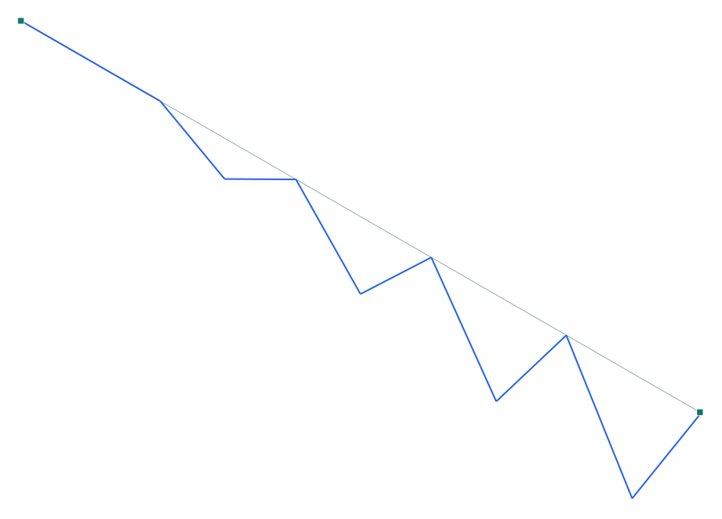

# Verificación 1-017 — Vibración de una cuerda bajo tensión (modal con rigidez geométrica)

**Capacidad verificada:** análisis modal con rigidez geométrica Kg desde un estado de referencia (rigidización por tracción / pre-esfuerzo).
**Referencia:** CSI *Software Verification — SAP2000*, Example 1-017; independiente por la teoría de cuerda vibrante (Kreyszig 1983, pp. 506-510).
**Modelo Pórtico:** [`examples/verif_1-017_cuerda_tensa.s3d`](../../examples/verif_1-017_cuerda_tensa.s3d)

## Descripción del problema

Una cuerda flexible de 100 in, anclada en ambos extremos y **tensada a 0.5 k**, vibra lateralmente. Las tres primeras frecuencias provienen de la **rigidez geométrica por tracción** (la cuerda casi no tiene rigidez a flexión: alambre de 1/16"). Se modela como una barra discretizada en 10 elementos; la tensión se aplica con una carga estática (0.5 k axial en el extremo móvil) que genera el **estado de referencia para Kg**, y el modal se corre sobre **K + Kg(estado)** (#55). Se comparan f₁, f₂, f₃ con la teoría de cuerda vibrante.

| Propiedad | Valor |
| --- | --- |
| Geometría | cuerda de 100 in, 10 elementos |
| Sección | alambre 1/16" Ø, A = 0.00306796 in² |
| Módulo E | 30 000 k/in² |
| Masa por volumen | 7.324×10⁻⁷ k·s²/in⁴ |
| Tensión | T = 0.5 k (carga axial de referencia) |

## Modelo en Pórtico

- La **tensión** se introduce con un caso estático (F_x = 0.5 k en el extremo libre axialmente) → estado de referencia con N = +0.5 k uniforme.
- El modal corre sobre **K + Kg** con el toggle «incluir rigidez geométrica P-Δ» (#55): la tracción rigidiza los modos laterales. Sin Kg, la cuerda (EI≈0) no tendría rigidez transversal.
- Frecuencia analítica de cuerda: f_n = (n/2L)·√(T/μ), con μ = ρ·A la masa por unidad de longitud.

*Figura 1. Primer modo lateral de la cuerda tensa (×escala) — media onda senoidal, rigidez aportada íntegramente por la tracción (Kg).*

## Resultados — comparación

Tres primeras frecuencias de la cuerda tensa. La referencia independiente es la teoría de cuerda vibrante (Kreyszig). El modal de Pórtico usa K+Kg del estado tensado.

| Modo | Descripción | Independiente (Hz) | SAP2000 (Hz) | dif. SAP | **Pórtico (Hz)** | **dif. Pórtico** |
| --- | --- | --- | --- | --- | --- | --- |
| f₁ | Primer modo (media onda) | 74.586 | 74.579 | -0.01 % | **74.587** | **0 %** |
| f₂ | Segundo modo (onda completa) | 149.170 | 148.930 | -0.16 % | **149.185** | **+0.01 %** |
| f₃ | Tercer modo (1½ onda) | 223.760 | 222.060 | -0.76 % | **223.804** | **+0.02 %** |

### Rigidización por tracción (Kg)

La cuerda casi no resiste flexión (EI del alambre de 1/16" ≈ 0); toda la rigidez lateral proviene de la **tracción**: la matriz Kg (ensamblada con N = +0.5 k del estado de referencia) se suma a K antes del modal. Es el mecanismo de **modal con rigidez geométrica** (#55), análogo al «modal sobre un caso no lineal con P-Δ» de SAP2000.

La frecuencia teórica f_n = (n/2L)·√(T/μ) = 74.586·n Hz da 74.586 / 149.17 / 223.76 Hz.

### Masa consistente vs concentrada

Con sólo 10 elementos y **masa consistente**, Pórtico alcanza la solución analítica (dif ≤ 0.02 %), superando al Model A de SAP2000 (10 elementos, masa **concentrada**: f₃ −0.76 %) e igualando su Model B (100 elementos). El refinamiento a 100 elementos no cambia el resultado de Pórtico.

## Conclusión

Pórtico reproduce las tres primeras frecuencias de la cuerda tensa con **diferencia ≤ 0.02 %** (74.587 / 149.18 / 223.80 Hz vs 74.586 / 149.17 / 223.76 Hz analíticos), con sólo 10 elementos. El **modal con rigidez geométrica Kg** (#55) —donde la rigidez lateral proviene íntegramente de la tracción del estado de referencia— queda validado contra la teoría de cuerda vibrante. **Capacidad de modal con Kg / pre-esfuerzo verificada.**
