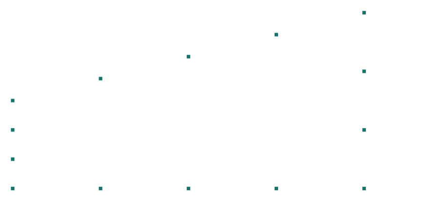

# Verificación 3-001 — Patch test de membrana — malla transfinita distorsionada

**Capacidad verificada:** mallador transfinito (Coons) de áreas → QUAD conformes que pasan el patch test de tensión constante en una malla NO rectangular.
**Referencia:** Patch test de elementos finitos (Irons & Razzaque; MacNeal-Harder): un elemento es convergente si reproduce EXACTAMENTE un estado de deformación constante en cualquier malla distorsionada.
**Modelo Pórtico:** [`examples/verif_3-001_patch_test_malla.s3d`](../../examples/verif_3-001_patch_test_malla.s3d)

## Descripción del problema

Panel **trapezoidal** (lado izquierdo de 1 m, derecho de 2 m) mallado por **interpolación transfinita de Coons** en 4×3 = 12 cuadriláteros **distorsionados** (no rectangulares). Se impone en TODO el borde un campo de desplazamiento **lineal** u = (εₓ·x, −ν·εₓ·y) con εₓ = 10⁻⁴ (vía desplazamiento prescrito de nodo, #54). Es el **patch test** clásico: si el mallador genera elementos conformes y correctamente mapeados, el interior reproduce el campo **exacto** y la tensión es la **constante** teórica (estado uniaxial σ₁ = E·εₓ, σ₂ = 0), independientemente de la distorsión de la malla.

| Propiedad | Valor |
| --- | --- |
| Geometría | trapecio 4 m × (1→2 m), malla 4×3 transfinita (Coons) |
| Elementos | 12 QUAD (membrana), distorsionados |
| E | 2.1·10¹¹ Pa |
| ν | 0.3 |
| Campo impuesto | u = (εₓ·x, −ν·εₓ·y), εₓ = 10⁻⁴ |
| Estado teórico | σ₁ = E·εₓ = 2.1·10⁷ Pa, σ₂ = 0 |

## Modelo en Pórtico

- La malla la genera `coonsGridFromCorners` (mesh_map.js); con lados rectos coincide con el mallador de bloque, pero el trapecio produce **QUADs distorsionados** — el caso exigente del patch test.
- El campo lineal se impone con **desplazamiento prescrito** (#54) en los nodos del borde; los nodos interiores quedan libres.
- La tensión se reporta por sus **invariantes** (principales σ₁, σ₂): las componentes σx/σy de cada celda están en su marco local inclinado, pero σ₁/σ₂ no dependen del marco.

*Figura 1. Malla trapezoidal (4×3 QUAD distorsionados) deformada bajo el campo lineal impuesto (×escala). El interior sigue exactamente el campo del borde.*

## Resultados — comparación

Tensiones principales de un elemento interior (todas las celdas dan el mismo valor constante). El patch test pasa si coinciden con el estado uniaxial teórico.

| Cantidad | Descripción | Independiente (Pa) | SAP2000 (Pa) | dif. SAP | **Pórtico (Pa)** | **dif. Pórtico** |
| --- | --- | --- | --- | --- | --- | --- |
| 1 | σ₁ (tensión principal mayor) = E·εₓ | 21000000.0 | 21000000.0 | 0 % | **21000000.0** | **0 %** |
| 2 | σ₂ (tensión principal menor) ≈ 0 | 0.0 | 0.0 | ≈0 | **-0.0** | **≈0** |

### Por qué es una verificación del MALLADOR

El cuadrilátero isoparamétrico Q4 reproduce un campo lineal **exactamente sólo si está bien construido y conforme** (numeración correcta, Jacobiano positivo, nodos del borde soldados). Que σ₁ = E·εₓ **a precisión de máquina** en una malla trapezoidal (no rectangular) demuestra que el mallador transfinito entrega elementos válidos y conformes en geometrías irregulares — el objetivo de la Fase 1.

Verificado además en `test_mesh_map.mjs`: los nodos interiores reproducen el campo lineal con error < 10⁻⁹ m, σ₁ = E·εₓ y σ₂ = 0 con error < 10⁻⁹ relativo, la malla de Coons con lados rectos coincide con el mallador de bloque, sigue bordes curvos (sector anular R=4→6) y no genera elementos invertidos (Jacobiano > 0).

## Conclusión

El mallador transfinito (Coons) genera una malla trapezoidal de QUADs distorsionados que **pasa el patch test de membrana a precisión de máquina** (σ₁ = E·εₓ = 2.1·10⁷ Pa, σ₂ ≈ 0). Los elementos son conformes y correctamente mapeados en geometría no rectangular. **Mallado transfinito de áreas (#52, Fase 1) verificado.**
